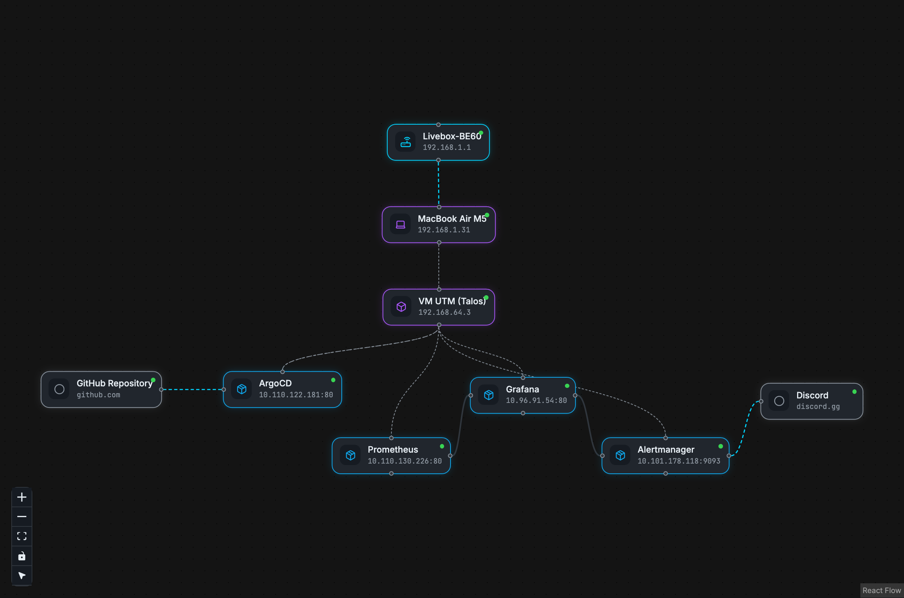

# homelab

Self-hosted homelab: Talos Linux + Kubernetes, provisioned with Terraform, deployed via ArgoCD. Currently a single-node PoC, migrating to 3x Proxmox NUCs.

## Stack

- **Talos Linux**: immutable, API-driven Kubernetes OS
- **Terraform / OpenTofu**: infra provisioning (Talos bootstrap, ArgoCD install)
- **ArgoCD**: GitOps continuous deployment
- **Kustomize + Helm**: unified manifest/chart deployment

## Architecture

Two-phase model: Terraform does one-time bootstrap (Talos + ArgoCD), ArgoCD owns everything after that from Git.

## Status

Currently running mono-node on a local UTM VM (proof of concept before real NUC hardware arrives). See [ADR](docs/adr/) for key decisions.

## Roadmap

- [ ] Migrate to 3x Proxmox NUCs (HA control-plane)
- [ ] MetalLB + ingress + cert-manager
- [ ] Persistent storage (Rook-Ceph)
- [ ] SSO (Authentik)
